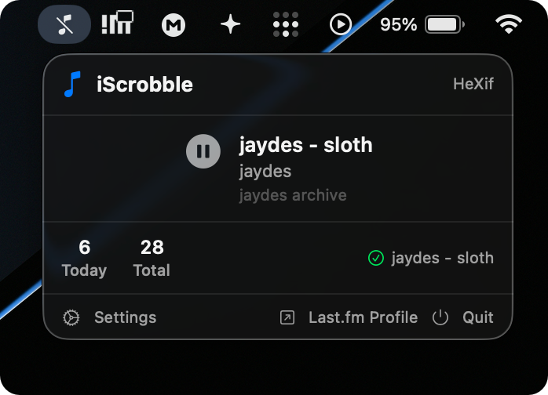
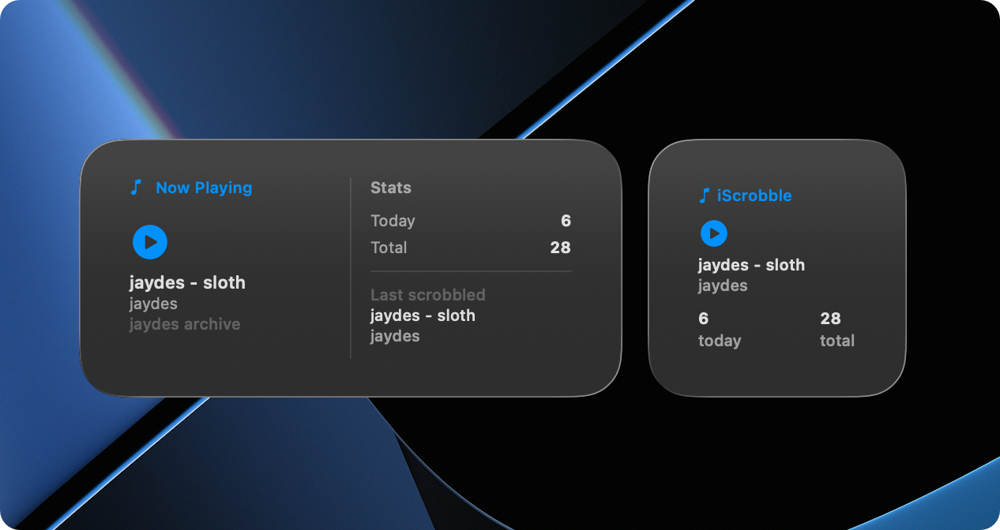
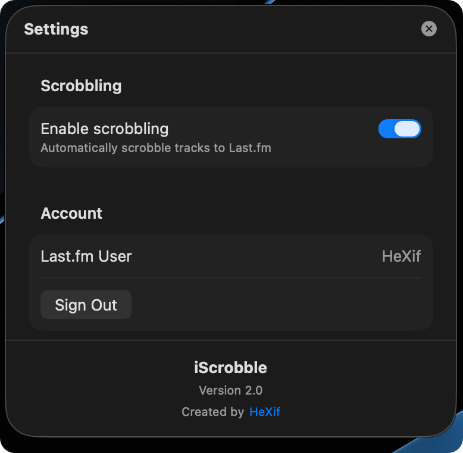

<div align="center">
  
  <h1>iScrobble</h1>
  <p>Last.fm scrobbler for Apple Music on MacOS</p>
</div>

## About this project
I built this as the native last.fm scrobbler for macos is stopping support for silicon macs (i think) and the annoying "Support ending for Intel-based Apps" notification. iScrobble is built entirely on swift and uses the free last.fm API for scrobbling tracks and logging in. 

**Built on MacOS Version 26.4 Beta (25E5223i), unsure if it works on other versions.**

## Interface

### Main interface



### Widget Support
iScrobble supports lovely widgets showing scrobble stats for the day and the currently playing song



### Settings
Super simple settings screen, lastfm api configuration is below this.



## How to install

1. Download the [latest release](https://github.com/xHeXifx/iScrobble/releases/latest)
2. Move iScrobble.App to Applications (widgets and maybe other features wont work if you don't move it)
3. Open iScrobble and click the icon in the menubar
4. Enter API credentials from [https://www.last.fm/api/account/create](https://www.last.fm/api/account/create)

## How to build from source

### Prerequisites
- Xcode and Git installed
- An active Apple Developer account (for signing)

### Build Instructions

1. **Clone the repository**
  ```bash
  git clone https://github.com/xHeXifx/iScrobble
  ```

2. **Open the project in Xcode**
  - Navigate to the cloned directory
  - Open `iScrobble.xcodeproj` in Xcode

3. **Configure signing**
  - Select the project in Xcode's navigator
  - Go to "Signing & Capabilities" tab
  - Select your development team

4. **Build the project**
  - Press the play button in the top left
  - The project will build and run

0. **How to build to a .App**
  - Select "Product" > "Archive"
  - In archives: "Distribute App"
  - "Custom" > "Copy App" > Choose a location
  - The .App will be stored there.

### Troubleshooting
- If you encounter signing errors, ensure your Apple ID is added in Xcode Preferences → Accounts

## Known Issues
  - Clicking items on sub-views (e.g. settings view/api cred view) closes the menu. To click some stuff you'll have to go back and click the item AGAIN for it to trigger

## [LICENSE](/LICENSE)